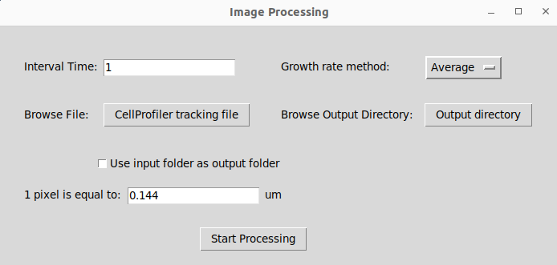

# CellProfilerAnalysis
Codes used to analyze CellProfiler output

## Converting CellProfiler data similar to CellModeller:

The process can be done by GUI. GUI Input file is CellProfiler output including columns:  
"ImageNumber, ObjectNumber, AreaShape_MajorAxisLength, AreaShape_MinorAxisLength, AreaShape_Orientation, Intensity_MeanIntensity_rfp/gfp/yfp_channel (optional), Location_Center_X (or AreaShape_Center_X), Location_Center_Y (or AreaShape_Center_Y), TrackObjects_Label_50, TrackObjects_ParentImageNumber_50, TrackObjects_ParentObjectNumber_50"
  
After choosing output file directory(same as input or wherever you select), and setting interval time based on your experiments and growth rate methods (average or linear regression) the process will be done by pressing start button. GUI final messages will guide you where the output is and whether the process is done. Final output is stored in both csv files and pickles for each time-step.

 

  

